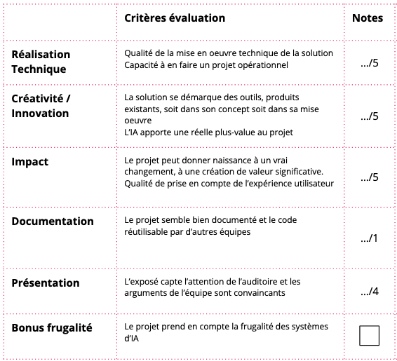

# Guide des participant·e·s au Hackathon Mobilités 2025

Bienvenue dans le Hackathon Mobilités 2025 organisé par Île-de-France Mobilités.

## _Hackathon Mobilités_

Après l’édition de 2024 portant sur l’usage de l’IA et l’amélioration des services de mobilité, nous nous retrouverons cette année pour faire émerger des projets qui mobilisent la donnée au service d’une mobilité responsable (responsabilité environnementale, accessibilité…). 

L’objectif est d’explorer comment les données, leurs traitements et leurs restitutions peuvent avoir un impact, directement pour les usagers ou pour les autres acteurs en charge des mobilités, de la déclinaison des politiques de mobilités, ou de l’aménagement des territoires.

Nous avons ainsi formulé plusieurs défis et mettrons à la disposition des candidats des données et ressources adaptées pour y répondre.

Cette année nous vous proposons 4 défis :
- **Défi 1** - Évaluer l’impact des **mobilités actives** et de l’intermodalité
- **Défi 2** - Aider les entreprises à **décarboner** les mobilités de leurs salariés
- **Défi 3** - Créer des **outils d’analyses** des mobilités pour les collectivités franciliennes
- **Défi 4** - Améliorer **l’accessibilité et le confort** des services de mobilités

Ce guide des participant.e.s vous aidera tout au long de ce Hackathon et dans sa phase de préparation. 

## Sommaire
1. [Le programme](https://github.com/hackathons-mobilites/hackathon_mobilites_2025?tab=readme-ov-file#le-programme)
2. [Les défis](https://github.com/hackathons-mobilites/hackathon_mobilites_2025?tab=readme-ov-file#les-d%C3%A9fis)
2. [Les ressources et les outils](https://github.com/hackathons-mobilites/hackathon_mobilites_2025?tab=readme-ov-file#les-ressources-et-les-outils)
3. [Vos résultats](https://github.com/hackathons-mobilites/hackathon_mobilites_2025?tab=readme-ov-file#vos-r%C3%A9sultats)
4. [La FAQ](https://github.com/hackathons-mobilites/hackathon_mobilites_2025?tab=readme-ov-file#foire-aux-questions-faq)

## Le programme

### Les 5 dates clés du challenge
1. Les pré-inscriptions sont ouvertes du 1er juillet 2025 au 1er novembre 2025 ;
2. Mardi 14 octobre de 12h à 13h - [En ligne] Webinaire n°1 - Présentation du hackathon Mobilités 2025
3. Mardi 4 novembre de 12h à 13h - [En ligne] Webinaire n°2 - Présentation des défis du Hackathon Mobilités 2025;
4. Mercredi 12 novembre de 12h à 13h - Lancement en ligne - Constitution des équipes du Hackathon Mobilités 2025. Une heure de visio est prévue de 12h à 13h la veille du lancement en présentiel afin de pouvoir constituer les équipes en amont et d’avoir un maximum de temps de production dès le 13 novembre au matin. 
5. Le hackathon se tient les 13 et 14 novembre 2025 en présentiel à Paris, au premier étage du Pan Piper, 2-4 Imp. Lamier, 75011 Paris. 

### Jour 1 - jeudi 13 (début à 9h)

| Heure  | Activité                                             |
|--------|------------------------------------------------------|
| 9h     | Accueil                                              |
| 9h30   | Mot d’accueil de la présidente du jury               |
| 9h45   | Présentation de la plateforme et des ressources dédiées|
| 10h00  | Rappels logistiques et installation                  |
| **10h15**| **Lancement des projets**                          |
| *12h35*  | *Pause déjeuner*                                   |
| 13h35  | Reprise des projets                                  |
| 19h    | Fin de journée                                       |

### Jour 2 - Vendredi 14 (début à 8h)

| Heure  | Activité                                             |
|--------|------------------------------------------------------|
| 8h     | Accueil, reprise des projets                         |
| *12h30*  | *Pause déjeuner*                                   |
| 13h30  | Reprise des projets                                  |
| **15h**    | **Fin des travaux**                              |
| 15h15  | Pitchs                                               |
| 16h30  | Délibérations                                        |
| 16h50  | Mot de conclusion et annonce des résultats           |
| 17h30  | Cocktail                                             |
| 19h    | Fin de journée                                       |

## Les défis

Au cours de ces deux journées, vous relevez un défi en équipe de 4 à 7 personnes. L'objectif est de proposer un projet qui répondre à un des 4 défis proposés. [Les défis sont présentés dans ce document](https://github.com/hackathons-mobilites/hackathon_mobilites_2025/blob/main/docs/Pr%C3%A9sentation%20des%20d%C3%A9fis.md). 

- **Défi 1** - Mobilités actives et intermodalité : évaluation d'impact et propositions d'outils
- **Défi 2** - Outils à destination des entreprises
- **Défi 3** - Outils à destination des collectivités territoriales
- **Défi 4** - Accessibilité et confort des usagers des transports publics

## Les ressources et les outils

#### Le Slack

C'est sur le slack qu'auront lieu les principaux échanges ([lien d'invitation au slack](https://hackathonmobvingtcinq.slack.com)). Chaque canal possède une description dans un message épinglé.
- **00-general** : pour échanger librement sur le Hackathon, vous présenter, et poser vos questions à l'équipe d'organisation.
- **01-équipe-X-nom-équipe** : pour échanger en équipe
- **03-ressources et outils** : pour échanger sur les ressources et les outils mis à disposition par Île-de-France Mobilités 
- **04-données** : pour échanger sur les données mises à disposition par Île-de-France Mobilités et ses partenaires

Une fois ajouté sur le slack, **vous pouvez vous présenter dans le canal 00-general** et échanger dans les canaux dédiés. 

Les équipes se composeront librement, mais les organisateurs se réservent les droits de rééquilibrer les profils et niveaux entre les équipes ! Une fois les équipes constituées, vous rejoignez le salon de votre équipe. C'est l'occasion pour commencer à mieux vous connaître et à échanger sur la découverte des ressources et données mises à disposition. 

#### Le répertoire de code

Chaque équipe aura son propre **répertoire de code public** (Github ou Gitlab) pour développer son projet. 

Une fois un service d'IDE déployé sur Onyxia (voir ci-dessous) vous pouvez cloner votre répertoire pour travailler dessus.

Deux choses : 
- **Pour le README, veuillez [utiliser ce modèle](docs/Template README 2025.md)** (il vous servira pour l'envoi de votre projet à la fin du Hackathon).
- Ajoutez le topic *hackathonmobilites2025* à la description de votre répertoire (voir image ci-dessous)

#### La plateforme Onyxia et ses services

Onyxia est la plateforme que vous allez utiliser tout au long de ces deux jours. 

C'est une application web open-source développée par l’Insee conçue pour les data scientists en leur offrant un environnement de travail de pointe. En substance, Onyxia propose un catalogue de services (VSCode, Jupyter, etc...) que vous pouvez lancer depuis la plateforme.

1. Se connecter à [Onyxia](https://datalab.data-platform-self-service.net). Il faut créer un compte avec l'adresse email avec laquelle vous vous êtes inscrit·e·s au Hackathon. 
2. Une fois connecté·e à Onyxia, vous avez accès votre projet personnel. Vous serez ajouté·e au projet dédié au hackathon **"dlb-hackathon"** (voir image ci-dessous).
3. **Toutes les équipes travaillent à partir de ce projet**. C'est dans ce projet que sont partagées en tant que variables d'environnement les clés des différentes APIs et ressources mises à disposition.

Vous pouvez ensuite **lancer des services** (par exemple un service Visual Studio Code Python), et les lier au repositoire de code de votre groupe. Nommez bien vos services avec le nom de votre équipe "EQUIPE X".

 Attention, les services ne sont pas stables s'ils sont éteints, alors vous perdez leurs configurations. 
 
Pour en savoir plus : 
- Voir [ce tutoriel](https://docs.onyxia.sh/user-doc/setting-up-your-dev-environment-in-onyxia) pour configurer automatiquement le lancement d'un sevice.

Les principaux services proposés : 
| Nom du service | Description | Catégorie de service | Espace de lancement |
|----------------|-------------|----------------------|----------------------|
| Jupyter python | IDE Jupyter avec les libraires data python pré-installées | Environnements de développement |dbl-hackathon : une instance par équipe|
| VSCode python | Visual Studio Code avec les libraire data python pré-installées | Environnements de développement |dbl-hackathon : une instance par équipe|
| Cloudbeaver | pour vos bases de données | Base de données |espace personnel (non partageable)|
| Metabase | pour analyser et visualiser vos données | Dataviz |dbl-hackathon : une instance commune à toutes les équipes|

#### Les ressources à votre disposition

Vous disposez d'un certain nombre de ressources. **Le but n'est pas de toutes les consulter**, mais qu'elles puissent vous faire gagner du temps lors de la réalisation de vos projets. 

##### Tableau récapitulatif des ressources 

| Ressource | Description | Lien |
|-----------|-------------|------|
| Les ressources IA | Accès aux ressources et modèles IA | [Lien secrets Onyxia](lien) |
| Les données et documents | Liste de toutes les données et documents | [lien](https://airtable.com/appGp6Hwf0NrmXQ9L/shrnmQYmL0lDKgS76/tblC8dlSqeplzyg0A) |
| Le notebooks de prise en main des données | Notebook pour prendre en main certains jeux de données | [lien](https://github.com/hackathons-mobilites/hackathon_mobilites_2025/tree/main/notebooks) |
| Les snippets de code | Snippets de code pour rapidement prendre en main les APIs | [lien](/notebooks/HM2025 - Snippets de code.ipynb) |
| Le scritps de itineraires piétonniers | permet de générer des itinéraires entre une gare et un POI | [lien](/notebooks/HM2025 - Snippets de code.ipynb) |

##### Les données et documents

Pour entraîner vos algorithmes, visualiser des données, utiliser des APIs ou encore alimenter votre RAG nous avons sélectionné pour vous des **données et documents**. 

Ils sont accessibles [depuis ce lien](https://airtable.com/appGp6Hwf0NrmXQ9L/shrnmQYmL0lDKgS76/tblC8dlSqeplzyg0A). Vous pouvez **filtrer les données sur le défi qui vous intéresse**. Certaines ressources sont issues du [Catalogue PRIM](https://prim.iledefrance-mobilites.fr/fr), d'autres sont directement ajoutées dans les fichiers du projet Onyxia 'dlb-hackathon'.

##### Les notebook de prise en main des données

Certains jeux de données ont été spécialement mis à disposition pour le Hackathon, et se trouvent dans les fichiers partagés sur Onyxia. Les équipes d'île-de-France Mobilités ont [partagé dans un notebook](https://github.com/hackathons-mobilites/hackathon_mobilites_2025/tree/main/notebooks) quelques fonctions pour prendre en main les données. Le notebook présente aussi quelques données intéressantes.

##### Les snippets de code

Ces **[snippets de code](/notebooks/HM2025 - Snippets de code.ipynb)** vont vous permettre de gagner du temps dans la prise en main des ressources à disposition et de l'écosystème data d'île-de-France Mobilités. Par exemple, pour réaliser les appels PRIM d'Île-de-France Mobilités.

#### Les exemples (notebook)

Vous pouvez **lancer les notebooks exemple directement sur Onyxia**. Pour cela, **assurez vous d'être connecté·e·s sur Onyxia et d'être sur le projet "dlb-hackathon"**, puis lancez un service type VSCODE-Python et importez-y les [notebook exemples](/notebooks/HM2025 - Snippets de code.ipynb) du dossier notebook de ce projet github.

Vous avez également à disposition un [guide d'utilisation du stockage des données sur Onyxia](/notebooks/HM2025 - Snippets de code.ipynb).

#### La documentation
Comme d'habitude, lisez les documentations en ligne des services utilisés !

## Vos résultats

### Publier vos réalisations
Vos projets viendront alimenter la communauté Data IA et mobilités. **Les réalisations seront publiées sous licences libres** (type MIT) et publiées sur **un répertoire de code public** (Github ou Gitlab). 

Concrètement, vous allez réaliser :
- un [support de présentation](https://drive.google.com/drive/u/0/folders/1F9pkX9DwDJxw5rXWIiKHeD_um1sa5BH9) pour le pitch ;
- le projet dans le répertoire de code public : des notebooks, applications, templates, jeux de données …. Le [modèle de README](docs/Template README 2025.md) doit vous servir à documenter votre projet ;
- tout autre forme qui pourra valoriser votre projet

**Chaque équipe présentera son projet au jury à l’oral**, dans un temps limité. Vous avez 4 minutes pour pitcher votre projet, suivies de 2 minutes de Q&R.

Rappel : 
- **Pour le README, veuillez [utiliser ce modèle](docs/Template README 2025.md)** (il vous servira pour l'envoi de votre projet à la fin du Hackathon).
- Ajoutez le topic *hackathonmobilites2025* à la description de votre répertoire (voir image ci-dessous)
- **Ajoutez le lien de votre répertoire** dans vos diapositives de pitch + vos canal slack en message épinglé

### Les prix

- **🏆Premier Prix**
- 🏆Deuxième Prix
- 🏆Troisième Prix
- 🎉Prix spécial du jury

Voici la grille qui sera remise au Jury (à titre indicatif, le Jury est souverain dans ses choix !)

## Foire Aux Questions (FAQ)

Cette FAQ regroupe les questions les plus fréquentes ou susceptibles d’être posées par les participant·e·s du hackathon. Elle sera enrichie au fur et à mesure selon les besoins.

1. Peut-on utiliser un autre environnement de développement que celui fourni par l’organisation ?

 
Vous pouvez tout à fait utiliser un environnement de développement en local (PyCharm, Neovim…), autre que le datalab Onyxia. Néanmoins, il est demandé aux participant·e·s de valider ce point en amont avec l’organisation de l’événement. En revanche, il est interdit d’utiliser des plateformes de type OpenAI, GCP, ou autre instance cloud/IA publique ou privée. Ces cas posent en effet la question du transfert à "l'extérieur" de certains jeux de données encore non publics.

 

2. Quelles données seront accessibles pour ce hackathon ?

 
Les données utiles aux défis sont accessibles via ce <a href="https://airtable.com/appGp6Hwf0NrmXQ9L/shrnmQYmL0lDKgS76">lien</a>. Vous aurez accès à des données déjà ouvertes et disponibles sur des portails open data, notamment le portail <a href="https://prim.iledefrance-mobilites.fr/fr/catalogue-data">PRIM</a>, mais également à des données exclusives au Hackathon. C’est le cas par exemple des données Transilien, RATP, ou des données de validation plus récentes que celles actuellement publiées par IDFM. Pour ce qui concerne ces données exclusives au Hackathon, le point 6.5 du règlement exclut de les rendre publiques, de les copier, de les extraire à des fins privées ou de les partager à des tiers. 

 

3. Les ressources mises à disposition par l’organisation seront-elles accessibles après le hackathon ?

 
Les données ouvertes spécifiquement pour le Hackathon ne sont pas encore à un niveau de qualité qui permet de les partager en externe. Elles ne seront donc plus utilisables au terme de l’événement. Mais l'objectif est de les ouvrir dans la foulée du hackathon.

 

4. Peut-on participer au Hackathon si on ne peut pas être physiquement présent·e pendant les deux jours de l’événement ?

 
Non, il n’est pas possible de participer au hackathon si vous ne pouvez pas physiquement être présent·e avec votre équipe **à Paris au Pan Piper, le 13 et le 14 novembre 2025, pendant les deux jours** . Il nous paraît important d’être ensemble pendant cet événement, et de favoriser des échanges interpersonnels physiques. De notre point de vue, quand on participe à un hackathon, c’est aussi pour les rencontres qu’on peut y faire.

 

5. Qu’est-il prévu pour la restauration pendant l’événement ?

 
L’organisation se charge de petits déjeuners d’accueil et des repas du midi. Il vous sera demandé vos préférences (par exemple végétarien·ne ou non) en amont de l’événement. Nous ne prenons pas en charge les dîners, en revanche un cocktail de clôture est prévu le vendredi après la remise des prix à partir de 18h, toujours dans le même espace, au premier étage du Pan Piper à Paris. 

 

6. Comment puis-je trouver une équipe ?

 
La constitution des équipes s’effectue en amont de l’événement. Certaines équipes sont déjà constituées, d’autres pas encore. Cette année, nous mettons en place un pré-lancement du Hackathon en ligne, la veille de l'événement, pour que les participant·e·s puissent constituer leurs équipes. En effet, le mercredi 12 novembre de 12h à 13h, un rendez-vous en visio est prévu pour finaliser les équipes et ainsi démarrer plus rapidement le Hackathon le 13 novembre au matin. 
 
Si vous n’avez pas d’équipe et/ou que vous n’avez pas pu assister lors du rendez-vous en visio du 12 novembre, nous vous recommandons de vous présenter dans le slack du Hackathon et d’indiquer le défi qui vous intéresse le plus. Les échanges se font par ce canal. L’organisation aidera également à rapprocher les participant·e·s et les équipes en cours de constitution (n’hésitez pas à les contacter sur le slack dédié).

 

7. Comment rejoindre le Slack de l’événement ?

 
Pour rejoindre le slack, il suffit de suivre ce <a href="https://hackathonmobvingtcinq.slack.com">lien</a>. Nous vous invitons à vous présenter dans le canal #00-general. Vous y trouverez les autres participant·e·s et tous les échanges passeront par cet outil.

 

8. Où puis-je trouver les infos pratiques, les ressources et les liens du hackathon ? 

 
Vous trouverez le guide des participant·e·s sur notre <a href="https://github.com/IleDeFranceMobilites/hackathon_ia_mobilites_2024/tree/main">GitHub</a>. Il contient les informations pratiques (horaires, lieu, etc.), la description des défis proposés, le tuto pour se connecter à la plateforme Onyxia, des snippets de code… Bref, toutes les ressources dont vous aurez besoin !

